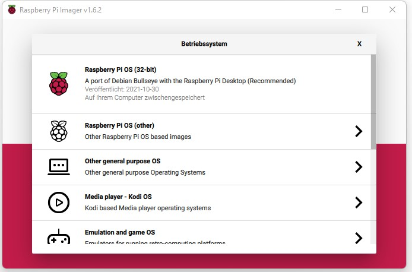
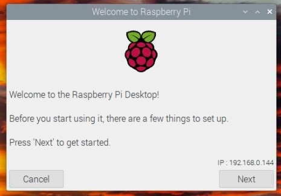
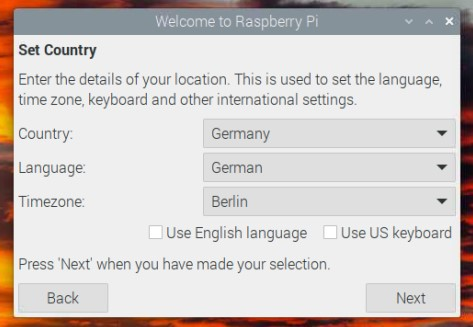
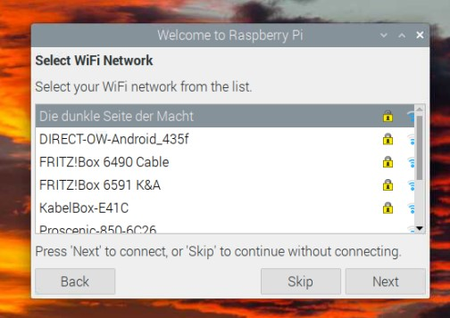
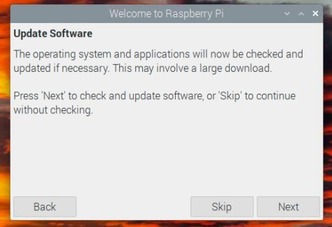
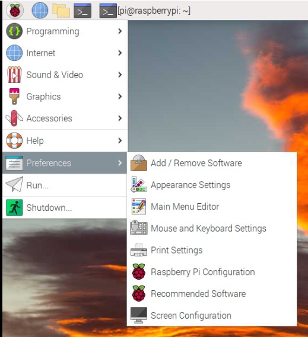
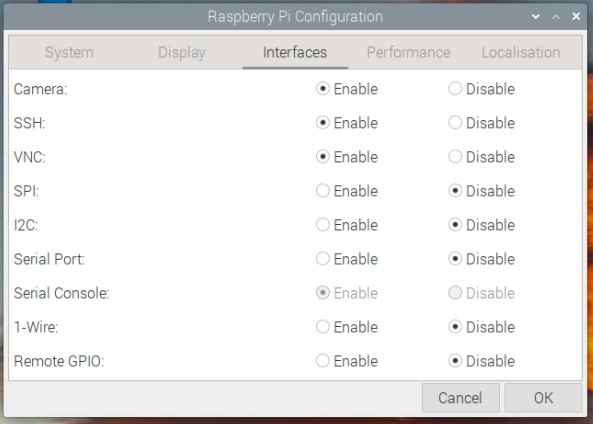
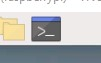
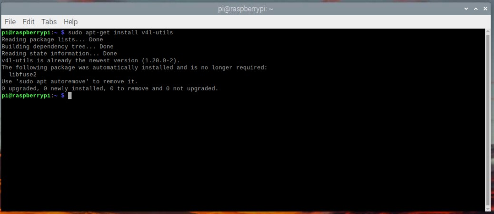

# Setup with RP4, using Raspbian with Desktop

This Manual should guide you through a setup using a Windows PC to prepare the Raspberry Pi Image and then successfully start autodarts.
Its a fairly simple manual and you have to connect a Monitor, Keyboard and Mouse to your Raspberry to properly set it up.But you can disconnect it from your PC and put it over to the Raspberry if you don't have a second set of theese, you won't need it at the same time.

*Let's a go!*

___

# Needed:

## Physical
- Windows PC
- Raspberry Pi (4)  / *Monitor, Keyboard, Mouse
  - with connected Cameras to USB
- SD Card
- Card Reader

## Virtual
- LAN, or WLAN connection
- Raspberry Pi Imager - [click to download](https://downloads.raspberrypi.org/imager/imager_latest.exe)
- VNC Viwer Win 32/64 - [click to download](https://www.realvnc.com/download/file/viewer.files/VNC-Viewer-6.21.1109-Windows.exe) | *optional*

___

# Prepare SD Card:

- Put your SD Card in the Card Reader and connect it to your Windows PC
- Open Raspberry Pi Imager


- Click on OS and select topmost option "Raspberry PI OS (32-bit)


- Click on SD-Card and select your SD-Card-Drive
- *for most of the time you only should see one drive to select*


- Hit write!

This takes about 5 minutes, depending on your SD-Card and Card-Reader and if finished should tell you to take out the SD-Card


- Now you can insert it to your Raspberry Pi and fire it up.

___

# Prepare Linux Desktop:

- When your Raspberry Pi has started its greeting you with a friendly Setup-Wizard



- Make your way through this wizard and select your Wifi-Connection. Updates are not Mandatory at this point, as it would take some time and is not needed.
- Also you CAN change your Password, but unless you are sure how to use Linux and its console i would recommend to leave it as it is.

  
 

- After finishing the Setup-Wizard its absolutely mandatory to enable SSH first. This will be your connection to your Windows PC
- For this click on the Raspberry-Menu and got to "Preferences -> Raspberry Pi Configuration"
- In the configuration Window go to the "Interfaces"-Tab and enable SSH and if you like VNC
  - VNC is a virtual Desktop environment to be used with Windows *aka : nice to have feature*

 

- Now you have finished your Linux and are able to control it from your Windows PC, or you can continue on this Raspberry Desktop
- As this is the Desktop Guide it continues on the Raspberry Pi Desktop

___

## Console work:

- Open up your Console / Command Prompt. Its the black little Button on the Start-Bar


- It will open up and show you this prompt (depending on your username, if you had changed while setup)


### Install v4l-utils (and get your Camera-ID's):

- Open up your console and enter
```
sudo apt-get install v4l-utils
```


- after installing this you can list your USB-devices with the following command
```
v4l2-ctl --list-devices
```


- Note down the first entry below your 3 cameras
  - In my case it's Video0 / Video 4 / Video2
  - Theese are your Camera ID's for later configuration in Board Manager

___

### Get Autodarts running

You can install autodarts on a Linux system by using this single command. It will automatically download the latest version and install a systemd service to automatically start autodarts on startup. You might have to install curl on your machine beforehand. You can do so with sudo apt install curl.
```
bash <(curl -sL get.autodarts.io)
```
If you do not want the autostart systemd service to be installed, you can use the -n flag as follows.
```
bash <(curl -sL get.autodarts.io) -n
```
If you want to install a specific version, say, 0.16.0, then you can append the required version to the command as follows. This can be helpful if you want to downgrade to an earlier version. This also works with the -n flag from before.
```
bash <(curl -sL get.autodarts.io) 0.16.0
```
You can control the the autodarts.service with the systemctl command.
```
sudo systemctl start autodarts
sudo systemctl stop autodarts
sudo systemctl restart autodarts
sudo systemctl status autodarts
sudo systemctl disable autodarts
sudo systemctl enable autodarts
```
If you want to see the log output, you can use the following command.
```
journalctl -u autodarts -f
```
For Windows and MacOS, which are not well tested, you can go to the releases pages and download the individual versions directly from there. Make sure that you download the correct version for your Mac, Intel vs Apple Silicon (amd64 vs arm64).


## Cheering up - it's running!

- Continue with next Steps like Configuration or Calibration according to the Full Manual
  - [The Full Manual](https://github.com/autodarts/docs#readme)
- Best would be to get the Autodarts in the Autostart so that the program is running when you power on the Raspberry Pi
  -  [This Section of the Manual for Autodarts](https://github.com/autodarts/docs#setup-autostart-for-autodarts)


